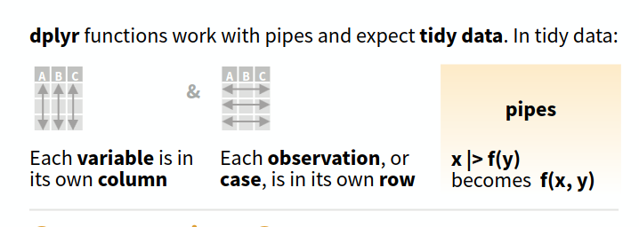
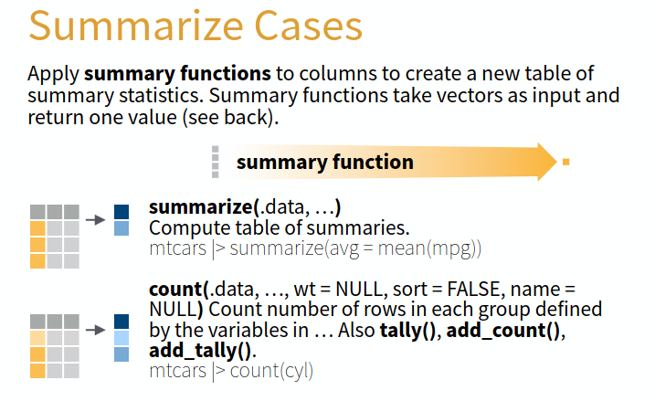
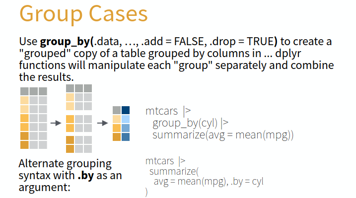
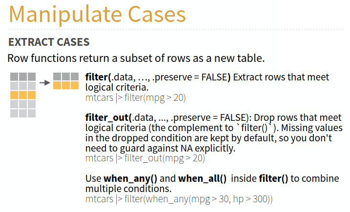
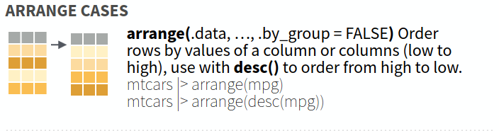
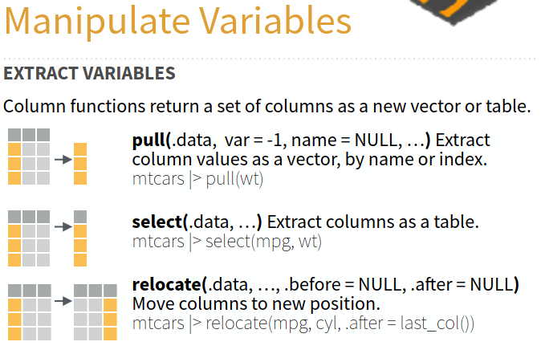
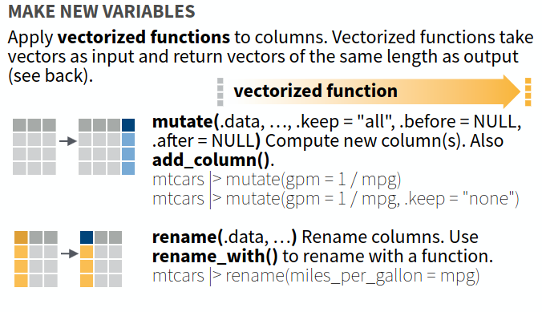
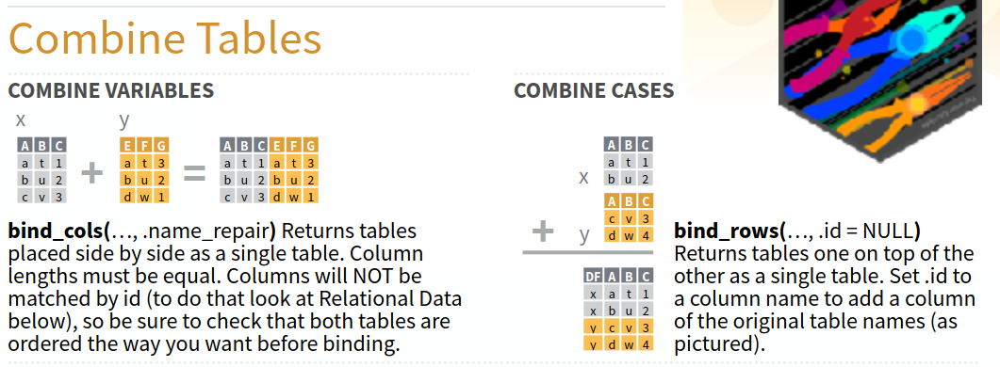
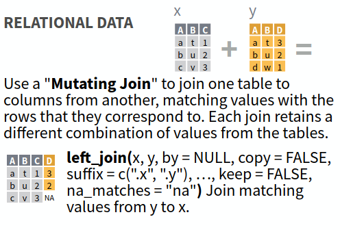

## Actividad 

```{=latex}
\footnotesize
```

::: {.callout-note title="Fase 1: Aprendizaje independiente en su grupo original (3 minutos)"}

  * Nos dividimos en grupos de 5 personas. 
  * Cada grupo tiene un experto para los distinctos aspectos:
    1. caracteristicas de los datos tidy y la manipulación con pipelines
    2. operaciones a nivel de **tabela** 
    3. operaciones a nivel de **fila**
    4. operaciones a nivel de **columna**
    5. uniendo datos
  * El experto, estudia el material sobre su enfoque específico.

:::


::: {.callout-note title="Fase 2: Aprendizaje colaborativo en grupos de expertos (3 minutos)"}


  * Los expertos de cada enfoque se reúnen en grupos para compartir sus conocimientos.
  * Aclaran dudas entre expertos, toman notas y se preparan para enseñar a su grupo original.
  * El experto prepara un reporte breve de:
     1. ¿Qué hace esta operación?
     2. ¿Qué cambia: las filas, las columnas, los valores, o el número de observaciones?
     3. Dé un ejemplo ecológico de cuándo la usaría. De la experiencia reciente con el analisis de datos en su grupo, mencione un caso concreto.

:::

::: {.callout-note title="Fase 3: Enseñanza en el grupo original (5 minutos)"}

  * Cada experto regresa a su grupo original y enseña a los demás miembros del grupo sobre su área específica.
  * Se discuten y resuelven dudas sobre las temas presentados por los expertos.

:::


::: {.callout-note title="Fase 4: Reflexión y cierre (5 minutos)"}

  * Se comparten conclusiones y se resuelven dudas finales con toda la clase.
  * Cada grupo original (no grupo de expertos) tiene que resolver la situación de la siguiente página (caja roja).

:::


```{=latex}
\normalsize
```



::: {.callout-important title="Situación (Fase 4)"}

Cada grupo original (no grupo de expertos) tiene que resolver la siguiente situación:

Tenemos una tabla llamada `muestras` con la abundancia (conteo) de macroinvertebrados de 4 sitios, 
medida en varias fechas; cada muestra cubre un área fija de 0.25 m².

| sitio  | fecha | conteo |
| ------ | ----- | ------ |

Tenemos una segunda tabla llamada `sitios`, con un solo valor de temperatura y oxígeno por cada 
uno de los 4 sitios (estos valores no varían por fecha).

| sitio  | temperatura | oxígeno |
| ------ | ----------- | ------- |


 Queremos, a partir de la tabla `muestras`:
 
   * quedarnos solamente con las muestras de septiembre (columna `fecha`);
   * agregar una columna de densidad (individuos/m²), dividiendo el conteo entre el área de la muestra;
   * calcular la densidad promedio de septiembre por sitio;
   * ordenar los sitios de mayor a menor densidad promedio;
   * agregar, para cada sitio, la temperatura y oxígeno desde la tabla sitios.
   
 ¿Qué operaciones necesitamos y en qué orden? ¿Con qué columna(s) se debe hacer la unión (join) entre las dos tablas? 

:::



## Material

En lo que sigue se presentan las principales funciones de manipulación de datos en R utilizando el 
enfoque tidy data. Todos los imagenes provienen del `dplyr` cheatsheet disponible en el siguiente enlace: 
[dplyr cheatsheet](https://github.com/rstudio/cheatsheets/blob/main/data-transformation.pdf).

## Tidy data (Datos ordenados) (experto 1)

Datos tidy:

  - Cada columna representa una variable.
  - Cada fila representa una observación.

{width="50%"}

Pipelines, el operador `|>` o `%>%`:

  - Facilitan la manipulación de datos tidy.
  - Toman la salida de una operación y la pasan como entrada a la siguiente operación 
  - Esto permite encadenar múltiples transformaciones de manera clara y concisa.

```r
datos |> filter(variable > valor) |> summarise(promedio = mean(variable))
```



## Operaciones a nivel de tabela (experto 2)

### Resumenes

`summarise()`:
  
  - Aplica una funcion para generar nueva tabela con resúmenes.
  - Permite obtener estadísticas descriptivas.
  - Se utiliza comúnmente junto con `group_by()` para obtener resúmenes por grupo.

```r
datos |> summarise(promedio = mean(variable))
```

{width="50%"}

### Agrupamiento

`group_by()`:

  - Agrupa los datos según una o más variables.
  - Crea version modificada de los datos con el agrupamiento aplicado.
  - Todos operaciones posteriores se aplican dentro de cada grupo.
  - Se utiliza comúnmente junto con `summarise()` para obtener resúmenes por grupo.

```r
datos |> group_by(variable_categorica)
```

{width="50%"}



## Operaciones a nivel de fila (experto 3)

### Filtrado (selección de filas)

`filter()`:

  - Selecciona filas que cumplen con una condición específica.
  - Permite filtrar los datos según valores de las columnas.
  - Se utiliza comúnmente para enfocarse en subconjuntos relevantes de los datos.

```r
datos |> filter(variable > valor)
```

{width="50%"}


### Ordenamiento de filas

`arrange()`:

  - Ordena las filas de un data frame según una o más columnas.
  - Permite especificar el orden ascendente o descendente.
  - Facilita la visualización y el análisis de los datos en un orden específico.

```r
datos |> arrange(variable)
```

{width="50%"}



## Operaciones a nivel de columna (experto 4)

### Selección de columnas

`select()`:

  - Permite elegir un subconjunto de columnas de un data frame.
  - Facilita trabajar solo con las columnas relevantes.
  - Se puede usar para reordenar columnas o renombrarlas.

```r
datos |> select(columna1, columna2)
```

{width="50%"}

### Creando nuevas columnas

`mutate()`:

  - Crea nuevas columnas o modifica las existentes.
  - Permite realizar cálculos basados en otras columnas.
  - Se utiliza comúnmente para agregar información derivada a los datos.

```r
datos |> mutate(nueva_columna = variable1 + variable2)
```

{width="50%"}



## Uniendo datos (experto 5)

### Uniendo datos sin claves

`bind_rows()`:

  - Permite combinar varias tablas con las mismas columnas.

```r
bind_rows(tabla1, tabla2)
```

{width="50%"}

### Uniendo datos con claves

`left_join()`:

  - Permite combinar dos tablas según una clave común, conservando todas las filas de la tabla izquierda.
  - Se utiliza comúnmente para agregar información adicional a un conjunto de datos existente.
  - No conserva las filas de la tabla derecha que no tienen coincidencias en la tabla izquierda.

```r
left_join(tabla1, tabla2, by = "clave")
```

{width="50%"}

> Hay otros tipos de uniones con claves, como `right_join()`, `inner_join()` y `full_join()`, que permiten 
> combinar tablas de diferentes maneras según las necesidades del análisis.