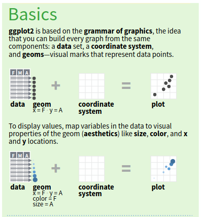
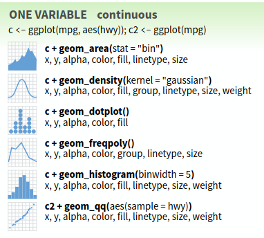
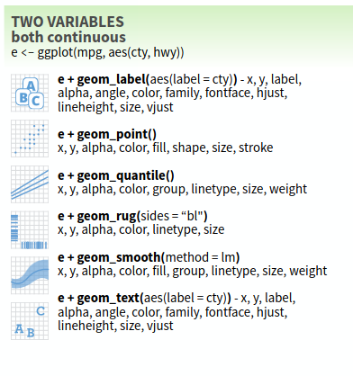
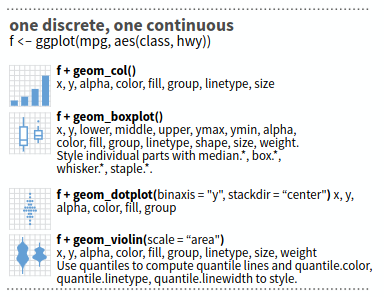
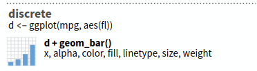
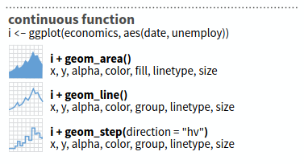

## Actividad

```{=latex}
\footnotesize
```

::: {.callout-note title="Fase 1: Aprendizaje independiente en su grupo original (3 minutos)"}

  * Nos dividimos en grupos de 5 personas.
  * Todo el grupo repasa junto la gramática de gráficos y `aes()` (sección común del material).
  * Cada grupo tiene además un experto para un tipo de gráfico:
    1. histograma
    2. diagrama de dispersión (scatterplot)
    3. boxplot
    4. gráfico de barras (barplot)
    5. gráfico de líneas (line plot)
  * El experto estudia el material sobre su tipo de gráfico específico.

:::


::: {.callout-note title="Fase 2: Aprendizaje colaborativo en grupos de expertos (3 minutos)"}

  * Los expertos de cada tipo de gráfico se reúnen en grupos para compartir sus conocimientos.
  * Aclaran dudas entre expertos, toman notas y se preparan para enseñar a su grupo original.
  * El experto prepara un reporte breve de 3 puntos:
     1. ¿Cómo se usa este tipo de gráfico? (función de `ggplot2` y estructura básica)
     2. ¿Qué necesita? (tipo de variable(s), cuántas, `aes()` requeridos)
     3. Un ejemplo de su experiencia reciente en clase: mencione un caso concreto de los datos que han analizado donde este tipo de gráfico sería apropiado.

:::

::: {.callout-note title="Fase 3: Enseñanza en el grupo original (5 minutos)"}

  * Cada experto regresa a su grupo original y enseña a los demás miembros del grupo sobre su tipo de gráfico.
  * Se discuten y resuelven dudas sobre los temas presentados por los expertos.

:::


::: {.callout-note title="Fase 4: Reflexión y cierre (5 minutos)"}

  * Se comparten conclusiones y se resuelven dudas finales con toda la clase.
  * Cada grupo original (no grupo de expertos) tiene que resolver la situación de la siguiente página (caja roja).

:::

```{=latex}
\normalsize
```



::: {.callout-important title="Situación (Fase 4)"}

Cada grupo original (no grupo de expertos) tiene que resolver la siguiente situación:

Tenemos una tabla llamada `muestras` con la densidad de macroinvertebrados (individuos/m²) de 4 sitios;
en cada muestra también se midió la temperatura y el oxígeno, en varias fechas.

| sitio  | fecha | densidad | temperatura | oxígeno |
| ------ | ----- | -------- | ----------- | ------- |

> Queremos:
>
>   * ver cómo se distribuyen los valores de densidad de todas las muestras;
>   * comparar la densidad entre los 4 sitios;
>   * ver la relación entre temperatura y densidad;
>   * mostrar el número de muestras tomadas en cada sitio;
>   * ver cómo cambia la temperatura a lo largo del tiempo en cada sitio.
>
> ¿Qué tipo de gráfico usarían para cada pregunta, y qué variables (columnas) irían en `aes()`?

:::

## Material

En lo que sigue se presentan los conceptos básicos de `ggplot2` y los tipos de gráficos más comunes.
Todos los imagenes provienen del `ggplot2` cheatsheet disponible en el siguiente enlace: 
[ggplot2 cheatsheet](https://rstudio.github.io/cheatsheets/data-visualization.pdf).



## Gramática de gráficos y `aes()` (todos)

Todo gráfico en `ggplot2` se construye a partir de capas:

  - **Datos**: un data frame en formato tidy.
  - **`aes()`** (mapeo estético): conecta variables de los datos con propiedades visuales (eje x, eje y, color, tamaño, etc.).
  - **`geom_*()`**: la representación geométrica que se dibuja (puntos, barras, cajas, etc.).

```r
ggplot(datos, aes(x = variable_x, y = variable_y)) +
  geom_*()
```

{width="45%"}

  - Se puede agregar más de un `geom_*()` a un mismo gráfico.
  - Los mapeos en `aes()` pueden ir dentro de `ggplot()` (para todas las capas) o dentro de un `geom_*()` (solo para esa capa).
  - Otras propiedades (color, tamaño, transparencia) pueden ser fijas o mapeadas dentro de `aes()`.



## Histograma (experto 1)

`geom_histogram()`:

  - Muestra la distribución de una variable numérica, dividiendo su rango en intervalos (bins).
  - Necesita una sola variable numérica continua mapeada a `x`.
  - Se utiliza comúnmente para ver la forma de la distribución (simetría, sesgo, valores atípicos).

{width="45%"}

```r
ggplot(datos, aes(x = variable_numerica)) +
  geom_histogram()
```



## Diagrama de dispersión / scatterplot (experto 2)

`geom_point()`:

  - Muestra la relación entre dos variables numéricas.
  - Necesita dos variables numéricas continuas, mapeadas a `x` y `y`.
  - Se utiliza comúnmente para explorar correlaciones o tendencias entre variables.

{width="45%"}

```r
ggplot(datos, aes(x = variable_x, y = variable_y)) +
  geom_point()
```



## Boxplot (experto 3)

`geom_boxplot()`:

  - Resume la distribución de una variable numérica según los grupos de una variable categórica.
  - Necesita una variable categórica en `x` y una variable numérica continua en `y`.
  - Se utiliza comúnmente para comparar la mediana, dispersión y valores atípicos entre grupos.

{width="45%"}

```r
ggplot(datos, aes(x = variable_categorica, y = variable_numerica)) +
  geom_boxplot()
```



## Gráfico de barras / barplot (experto 4)

`geom_bar()` / `geom_col()`:

  - Muestra el conteo o valor de una variable categórica.
  - `geom_bar()` necesita una variable categórica en `x` (calcula el conteo automáticamente); `geom_col()` necesita una variable categórica en `x` y un valor numérico ya calculado en `y`.
  - Se utiliza comúnmente para comparar cantidades o frecuencias entre categorías (por ejemplo, número de muestras por sitio).

{width="45%"}

```r
ggplot(datos, aes(x = variable_categorica)) +
  geom_bar()
```



## Gráfico de líneas / line plot (experto 5)

`geom_line()`:

  - Muestra la evolución de una variable numérica a lo largo de otra variable ordenada, típicamente el tiempo.
  - Necesita una variable numérica o de fecha/tiempo en `x` y una variable numérica continua en `y`.
  - Se utiliza comúnmente para ver tendencias temporales, a menudo agrupando por sitio con `color` o `group`.

{width="45%"}

```r
ggplot(datos, aes(x = fecha, y = variable_numerica, color = sitio)) +
  geom_line()
```
