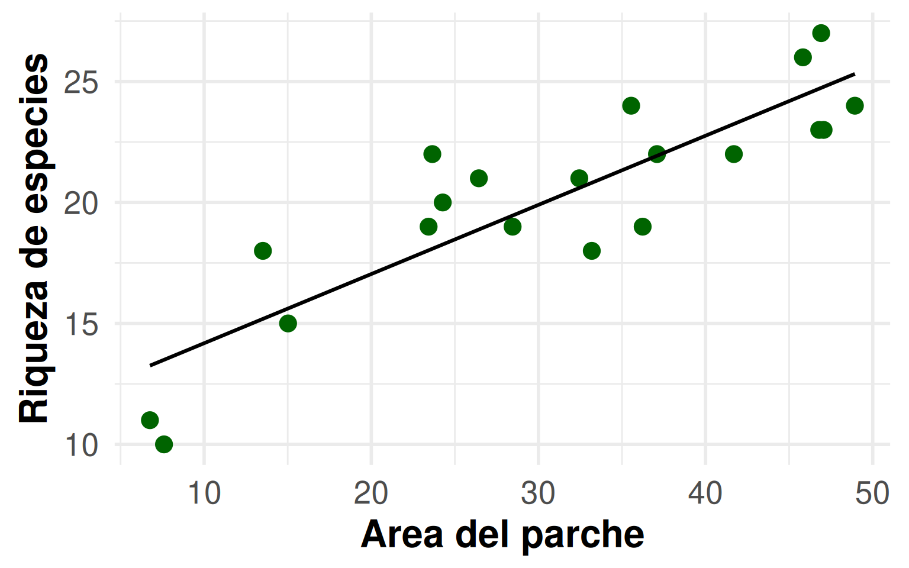
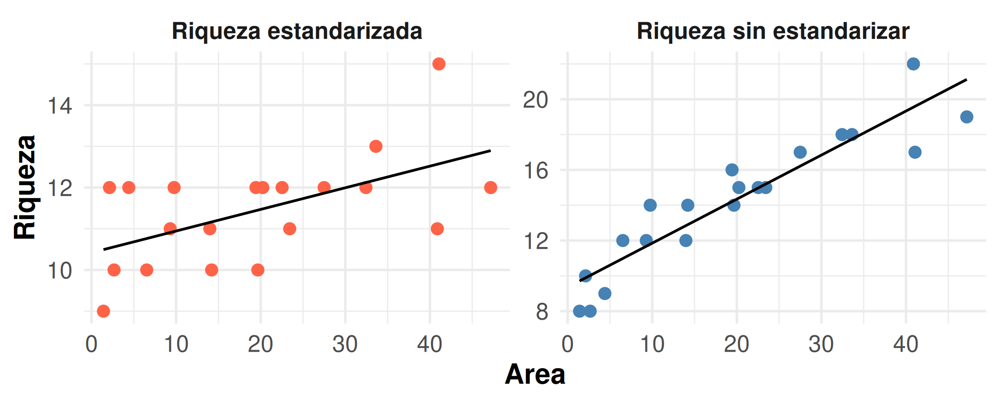
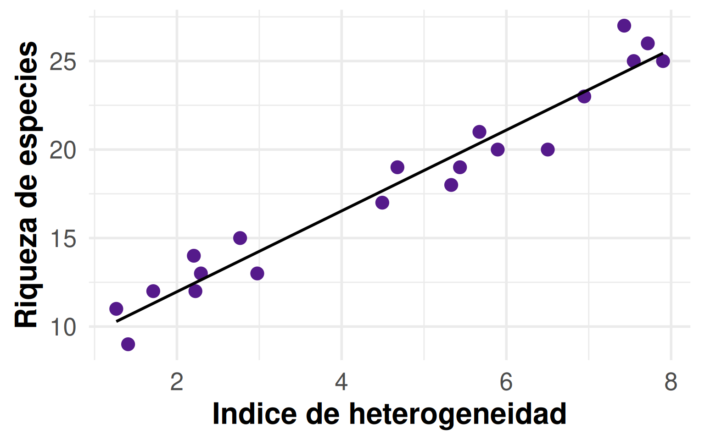
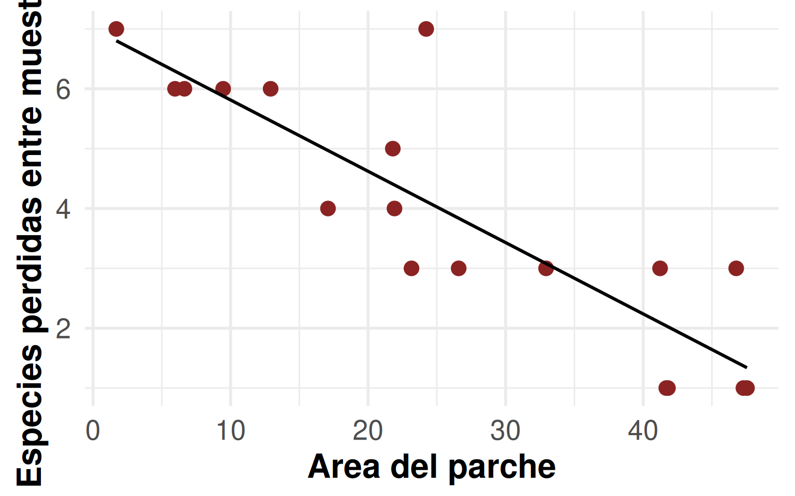
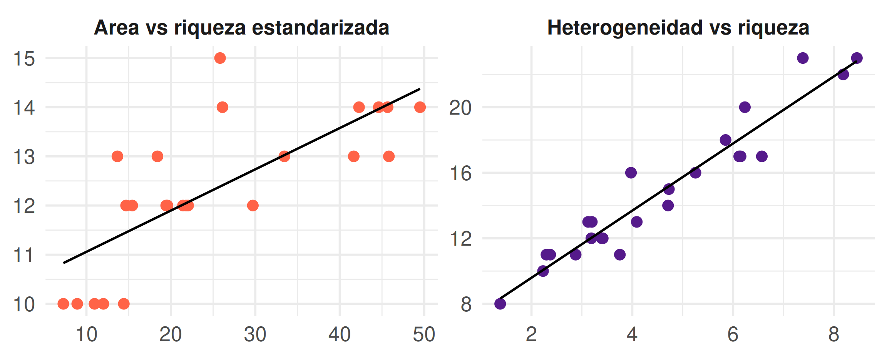
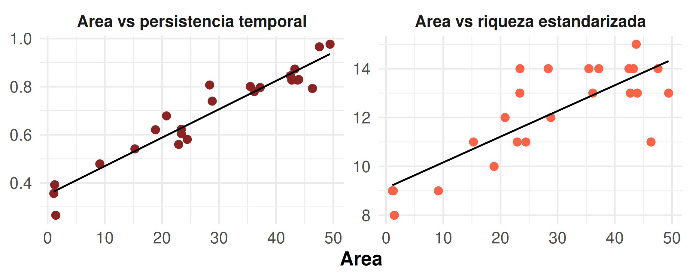
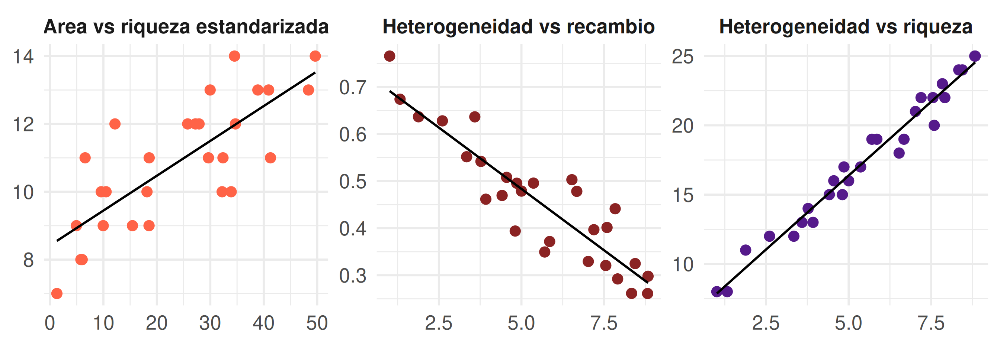
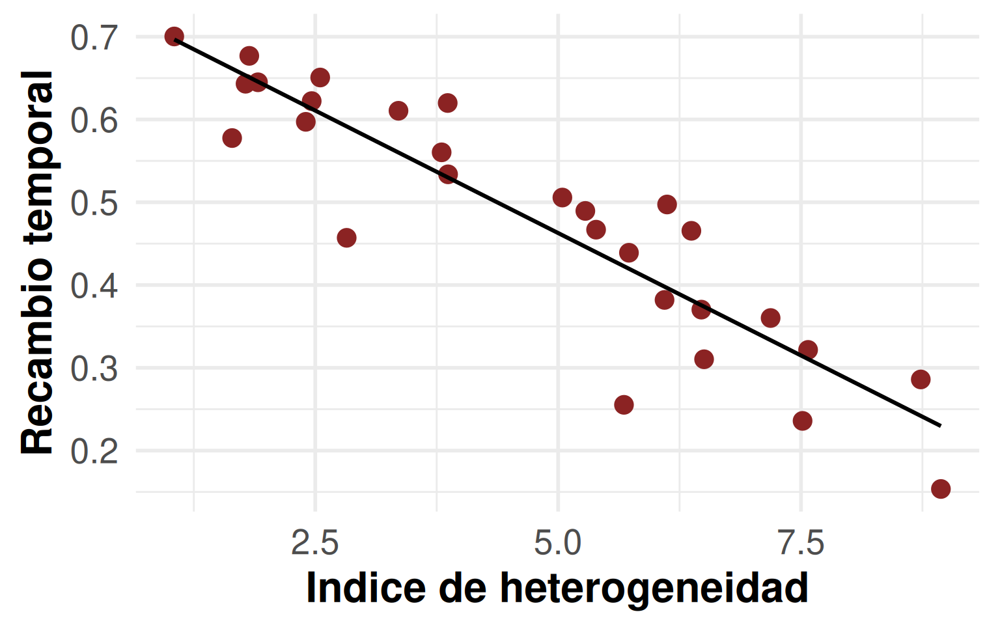
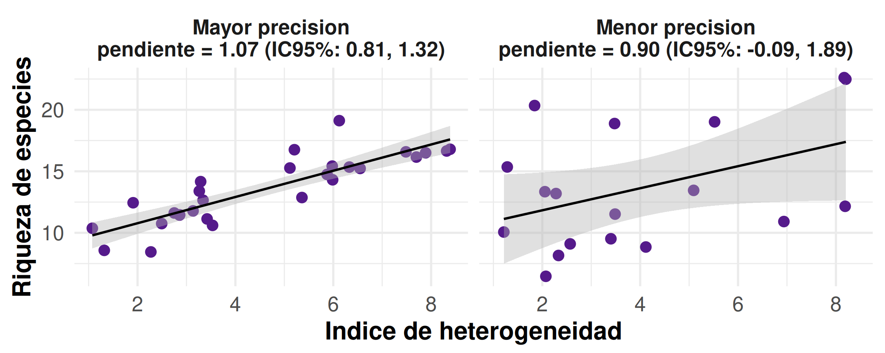

::: {.cell}

:::

## Plan

1. Entender como ecologos construyen explicaciones a partir de observaciones y comparacion de hipotesis.
2. Distinguir entre patron observado y mecanismo explicativo.
3. Usar predicciones para contrastar hipotesis alternativas.
4. Reforzar el metodo cientifico como proceso iterativo con incertidumbre.

## Observacion vs explicacion

Observacion:

- Parches de mayor area tienen mas especies.

::: {.fragment}
¿Por que?
:::

::: {.fragment}
Posibles explicaciones:

- A) Muestreo pasivo
- B) Heterogeneidad de habitat
- C) Colonizacion-extincion
:::

::: {.fragment}
El patron por si solo no identifica el mecanismo.
:::

## Observacion vs explicacion

Observacion:

- Parches de mayor area tienen mas especies.

::: {.fragment}
Necesitamos:

- hipotesis alternativas
- predicciones distintas
- comparacion de evidencia
:::

## Definiciones

> **Si P, entonces Q.** P es la hipotesis y Q es la prediccion.

> Una hipotesis es una explicacion propuesta y comprobable para un fenomeno ecologico observado.

> Una prediccion es una consecuencia observable de la hipotesis que puede ser contrastada con evidencia.

## Hipotesis A: Muestreo pasivo {.smaller}

Hipotesis:

- Los sitios grandes contienen mas individuos y por eso detectamos mas especies, aun sin cambios reales en procesos ecologicos.

Predicciones?

## Hipotesis A: Muestreo pasivo {.smaller}

Hipotesis:

- Los sitios grandes contienen mas individuos y por eso detectamos mas especies, aun sin cambios reales en procesos ecologicos.

::: {.fragment}
Predicciones:

::: {.incremental}
- La relacion area-riqueza deberia debilitarse al estandarizar el numero de individuos observados.
- Si el esfuerzo de muestreo es igual entre sitios, la diferencia de riqueza deberia reducirse.
- No necesariamente deberia aparecer una relacion fuerte entre area y diversidad de habitat.
:::
:::

## Hipotesis B: Heterogeneidad de habitat {.smaller}

Hipotesis:

- Los sitios grandes contienen mas tipos de microhabitat y nichos, permitiendo coexistencia de mas especies.

Predicciones?

## Hipotesis B: Heterogeneidad de habitat {.smaller}

Hipotesis:

- Los sitios grandes contienen mas tipos de microhabitat y nichos, permitiendo coexistencia de mas especies.

::: {.fragment}
Predicciones:

::: {.incremental}
- El numero de microhabitats deberia aumentar con el area.
- La riqueza deberia aumentar con heterogeneidad del habitat.
- Sitios con area similar pero mayor heterogeneidad deberian tener mayor riqueza.
:::
:::

## Hipotesis C: Colonizacion-extincion {.smaller}

Hipotesis:

- Los sitios grandes sostienen poblaciones mas grandes y estables, con menor extincion local y mayor persistencia temporal.

Predicciones?

## Hipotesis C: Colonizacion-extincion {.smaller}

Hipotesis:

- Los sitios grandes sostienen poblaciones mas grandes y estables, con menor extincion local y mayor persistencia temporal.

::: {.fragment}
Predicciones:

::: {.incremental}
- Sitios pequenos deberian mostrar mayor recambio temporal de especies.
- Sitios grandes deberian perder menos especies entre muestreos sucesivos.
- La persistencia de especies en el tiempo deberia ser mayor en parches grandes.
:::
:::

## ¿Que datos necesitamos?

::: {.incremental}
- area de cada parche
- riqueza de especies por parche
- abundancia total y esfuerzo de muestreo
- indice de heterogeneidad de habitat
- presencia/ausencia en multiples fechas (recambio temporal)
:::

## Evidencia 1: patron observado

::: {.cell layout-align="center"}
::: {.cell-output-display}
{fig-align='center' width=768}
:::
:::

::: {.fragment}
¿Que hipotesis favorece esta evidencia?
:::

::: {.fragment}
Favorece varias (A, B o C). Aun no distingue mecanismo.
:::

## Evidencia 2: estandarizacion por muestreo (A)

::: {.cell layout-align="center"}
::: {.cell-output-display}
{fig-align='center' width=1152}
:::
:::

::: {.fragment}
Si la pendiente cae mucho al estandarizar, aumenta soporte para hipotesis A.
:::

## Evidencia 3: heterogeneidad de habitat (B)

::: {.cell layout-align="center"}
::: {.cell-output-display}
{fig-align='center' width=768}
:::
:::

::: {.fragment}
Relacion fuerte con heterogeneidad: evidencia coherente con hipotesis B.
:::

## Evidencia 4: persistencia temporal (C)

::: {.cell layout-align="center"}
::: {.cell-output-display}
{fig-align='center' width=768}
:::
:::

::: {.fragment}
Menor perdida en sitios grandes: evidencia coherente con hipotesis C.
:::

## Evidencia combinada {.smaller}

::: {.cell layout-align="center"}
::: {.cell-output-display}
{fig-align='center' width=1152}
:::
:::

::: {.fragment}
¿Que hipotesis esta mejor apoyada por esta evidencia combinada?
:::

::: {.fragment}
**Hipotesis B.**

La riqueza estandarizada mantiene una pendiente positiva con area y, ademas, la riqueza aumenta con heterogeneidad del habitat.
:::

## Evidencia combinada {.smaller}

::: {.cell layout-align="center"}
::: {.cell-output-display}
{fig-align='center' width=1152}
:::
:::

::: {.fragment}
¿Que hipotesis esta mejor apoyada por esta evidencia combinada?
:::

::: {.fragment}
**Hipotesis C.**

La riqueza estandarizada se mantiene positiva con area y la persistencia temporal aumenta en parches grandes.
:::

## Evidencia combinada {.smaller}

::: {.cell layout-align="center"}
::: {.cell-output-display}
{fig-align='center' width=1344}
:::
:::

::: {.fragment}
¿Que hipotesis esta mejor apoyada por esta evidencia combinada?
:::

::: {.fragment}
**Soporte simultaneo para B y C.**

La heterogeneidad aumenta la riqueza (B) y, ademas, se asocia con menor recambio temporal, lo que sugiere mayor estabilidad (C).
:::

::: {.fragment}
**Punto clave:** a veces multiples hipotesis son parcialmente compatibles y los predictores pueden interactuar.
:::

## Evidencia adicional: recambio vs heterogeneidad (B-C)

::: {.cell layout-align="center"}
::: {.cell-output-display}
{fig-align='center' width=768}
:::
:::

::: {.fragment}
Mayor heterogeneidad se asocia con menor recambio: patron compatible con mayor estabilidad temporal.
:::

## Evidencia combinada {.smaller}

::: {.incremental}
- Una sola fuente de evidencia gráfica rara vez basta para distinguir mecanismos.
- El mismo patron especie-area puede surgir por procesos distintos.
- La inferencia mejora cuando comparamos predicciones especificas de hipotesis alternativas.
- A veces dos hipotesis reciben soporte al mismo tiempo y los predictores pueden interactuar (ej., heterogeneidad tambien mejora estabilidad).
- El objetivo es identificar la explicacion mas consistente con la evidencia disponible, no una verdad absoluta.
:::

## ¿Y si los datos no son claros?

::: {.fragment}
Misma direccion de efecto, distinta precision.
:::

::: {.fragment}
¿Interpretariamos estas dos figuras de la misma manera?
:::

::: {.fragment}

::: {.cell layout-align="center"}
::: {.cell-output-display}
{fig-align='center' width=1152}
:::
:::

:::

## Señal positiva con distinta precision {.smaller}

::: {.cell layout-align="center"}
::: {.cell-output-display}
{fig-align='center' width=1152}
:::
:::

::: {.fragment}
¿Qué hipótesis favorece esta evidencia?
:::

::: {.fragment}
Ambos paneles sugieren direccion positiva, pero en el caso de menor precision el IC95% de la pendiente es mas amplio.
:::

::: {.fragment}
La dirección del efecto y precisión de la evidencia son cosas distintas.
:::

::: {.fragment}
Con menor precisión, la evidencia sigue siendo compatible con una relacion positiva, pero con mayor incertidumbre sobre la magnitud del efecto.
:::

## Inferencia con incertidumbre {.smaller}

::: {.incremental}
- El IC95% de una pendiente indica un rango plausible para el efecto, no la probabilidad de que la hipotesis sea verdadera.
- Para B, el parametro clave es la pendiente heterogeneidad -> riqueza: esperamos signo positivo.
- Para C, el parametro clave es la pendiente heterogeneidad -> recambio (o area -> perdida): esperamos signo negativo.
- Si el IC95% incluye 0, la evidencia no permite descartar ausencia de efecto con ese diseno.
- Si el IC95% no incluye 0 y el signo coincide con la prediccion, aumenta el soporte para la hipotesis.
- El ancho del IC95% habla de precision: IC angosto = estimacion mas estable; IC amplio = mayor incertidumbre.
:::

::: {.fragment}
**Ejemplo B (soporte claro):** pendiente = 1.05, IC95% [0.42, 1.68].

Interpretacion: la relacion es positiva y consistente con B; ademas podemos reportar la magnitud aproximada del efecto.
:::

::: {.fragment}
**Ejemplo C (compatible pero incierto):** pendiente = -0.04, IC95% [-0.11, 0.01].

Interpretacion: la direccion media es la esperada para C, pero el IC95% incluye 0; se necesita mas precision antes de concluir soporte fuerte.
:::

::: {.incremental}
**Buenas practicas al reportar:**

- Reportar siempre pendiente (coeficiente) + IC95% + tamano de muestra.
- Evitar dicotomias de "significativo/no significativo" sin discutir magnitud y precision.
- Vincular / interpretar de la perspectiva de la hipotesis (no solo al signo o valor p).
:::

## Como poderiamos mejorar la precision de la evidencia?

::: {.incremental}

* Aumentar el tamaño de muestra (más sitios, más individuos, más fechas).
* Reducir el error de medición (estandarizar protocolos, calibrar instrumentos).
* Reducir la variabilidad no explicada (controlar covariables, usar modelos estadísticos apropiados).
* Mejorar el diseño de muestreo (aleatorización, replicación, bloqueos, estratificación).
:::

## Resumen

1. El patron especie-area es una observacion inicial, no una explicacion final.
2. A, B y C pueden explicar el mismo patron general, pero generan predicciones distintas.
3. Comparar multiples lineas de evidencia fortalece la inferencia ecologica.
4. El metodo cientifico en ecologia es iterativo: observar, plantear hipotesis, predecir, contrastar y revisar.

---

{fig-alt="Flujo del metodo cientifico" width="85%"}

