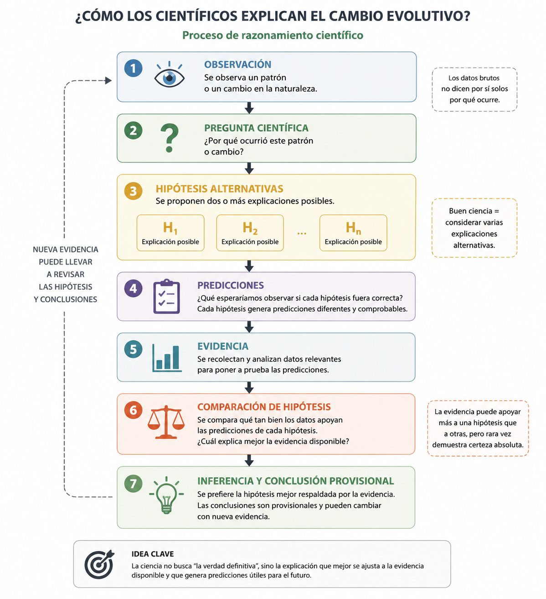

```{r}
library(ggplot2)

point_size <- 4.0
line_size <- 1.1

theme_eco <- theme_minimal(base_size = 22) +
  theme(
    axis.title = element_text(size = 24, face = "bold"),
    axis.text = element_text(size = 20),
    strip.text = element_text(size = 20, face = "bold"),
    legend.title = element_text(size = 20, face = "bold"),
    legend.text = element_text(size = 18),
    plot.margin = margin(8, 12, 8, 12)
  )
```

## Plan

1. Entender como ecologos construyen explicaciones a partir de observaciones y comparacion de hipotesis.
2. Distinguir entre patron observado y mecanismo explicativo.
3. Usar predicciones para contrastar hipotesis alternativas.
4. Reforzar el metodo cientifico como proceso iterativo con incertidumbre.

## Observacion vs explicacion

Observacion:

- Parches de mayor area tienen mas especies.

::: {.fragment}
¿Por que?
:::

::: {.fragment}
Posibles explicaciones:

- A) Muestreo pasivo
- B) Heterogeneidad de habitat
- C) Colonizacion-extincion
:::

::: {.fragment}
El patron por si solo no identifica el mecanismo.
:::

## Observacion vs explicacion

Observacion:

- Parches de mayor area tienen mas especies.

::: {.fragment}
Necesitamos:

- hipotesis alternativas
- predicciones distintas
- comparacion de evidencia
:::

## Definiciones

> **Si P, entonces Q.** P es la hipotesis y Q es la prediccion.

> Una hipotesis es una explicacion propuesta y comprobable para un fenomeno ecologico observado.

> Una prediccion es una consecuencia observable de la hipotesis que puede ser contrastada con evidencia.

## Hipotesis A: Muestreo pasivo {.smaller}

Hipotesis:

- Los sitios grandes contienen mas individuos y por eso detectamos mas especies, aun sin cambios reales en procesos ecologicos.

Predicciones?

## Hipotesis A: Muestreo pasivo {.smaller}

Hipotesis:

- Los sitios grandes contienen mas individuos y por eso detectamos mas especies, aun sin cambios reales en procesos ecologicos.

::: {.fragment}
Predicciones:

::: {.incremental}
- La relacion area-riqueza deberia debilitarse al estandarizar el numero de individuos observados.
- Si el esfuerzo de muestreo es igual entre sitios, la diferencia de riqueza deberia reducirse.
- No necesariamente deberia aparecer una relacion fuerte entre area y diversidad de habitat.
:::
:::

## Hipotesis B: Heterogeneidad de habitat {.smaller}

Hipotesis:

- Los sitios grandes contienen mas tipos de microhabitat y nichos, permitiendo coexistencia de mas especies.

Predicciones?

## Hipotesis B: Heterogeneidad de habitat {.smaller}

Hipotesis:

- Los sitios grandes contienen mas tipos de microhabitat y nichos, permitiendo coexistencia de mas especies.

::: {.fragment}
Predicciones:

::: {.incremental}
- El numero de microhabitats deberia aumentar con el area.
- La riqueza deberia aumentar con heterogeneidad del habitat.
- Sitios con area similar pero mayor heterogeneidad deberian tener mayor riqueza.
:::
:::

## Hipotesis C: Colonizacion-extincion {.smaller}

Hipotesis:

- Los sitios grandes sostienen poblaciones mas grandes y estables, con menor extincion local y mayor persistencia temporal.

Predicciones?

## Hipotesis C: Colonizacion-extincion {.smaller}

Hipotesis:

- Los sitios grandes sostienen poblaciones mas grandes y estables, con menor extincion local y mayor persistencia temporal.

::: {.fragment}
Predicciones:

::: {.incremental}
- Sitios pequenos deberian mostrar mayor recambio temporal de especies.
- Sitios grandes deberian perder menos especies entre muestreos sucesivos.
- La persistencia de especies en el tiempo deberia ser mayor en parches grandes.
:::
:::

## ¿Que datos necesitamos?

::: {.incremental}
- area de cada parche
- riqueza de especies por parche
- abundancia total y esfuerzo de muestreo
- indice de heterogeneidad de habitat
- presencia/ausencia en multiples fechas (recambio temporal)
:::

## Evidencia 1: patron observado

```{r, fig.width=8, fig.height=5, fig.align="center"}
set.seed(42)
area <- runif(20, 1, 50)
richness <- round(8 + 2.3 * sqrt(area) + rnorm(20, 0, 1.5))

df_obs <- data.frame(area = area, richness = richness)

ggplot(df_obs, aes(x = area, y = richness)) +
  geom_point(color = "darkgreen", size = point_size) +
  geom_smooth(
    method = "lm",
    se = FALSE,
    color = "black",
    linewidth = line_size
  ) +
  labs(x = "Area del parche", y = "Riqueza de especies") +
  theme_eco
```

::: {.fragment}
¿Que hipotesis favorece esta evidencia?
:::

::: {.fragment}
Favorece varias (A, B o C). Aun no distingue mecanismo.
:::

## Evidencia 2: estandarizacion por muestreo (A)

```{r, fig.width=12, fig.height=4.8, fig.align="center"}
set.seed(12)
area <- runif(20, 1, 50)
richness_raw <- round(6 + 2.0 * sqrt(area) + rnorm(20, 0, 1.4))
richness_std <- round(10 + 0.4 * sqrt(area) + rnorm(20, 0, 1.2))

df_a <- rbind(
  data.frame(
    area = area,
    richness = richness_raw,
    panel = "Riqueza sin estandarizar",
    col = "steelblue"
  ),
  data.frame(
    area = area,
    richness = richness_std,
    panel = "Riqueza estandarizada",
    col = "tomato"
  )
)

ggplot(df_a, aes(x = area, y = richness)) +
  geom_point(aes(color = panel), size = point_size) +
  geom_smooth(
    method = "lm",
    se = FALSE,
    color = "black",
    linewidth = line_size
  ) +
  facet_wrap(~panel, nrow = 1, scales = "free_y") +
  scale_color_manual(
    values = c(
      "Riqueza sin estandarizar" = "steelblue",
      "Riqueza estandarizada" = "tomato"
    )
  ) +
  labs(x = "Area", y = "Riqueza") +
  guides(color = "none") +
  theme_eco
```

::: {.fragment}
Si la pendiente cae mucho al estandarizar, aumenta soporte para hipotesis A.
:::

## Evidencia 3: heterogeneidad de habitat (B)

```{r, fig.width=8, fig.height=5, fig.align="center"}
set.seed(21)
heterogeneity <- runif(20, 1, 8)
richness_h <- round(7 + 2.4 * heterogeneity + rnorm(20, 0, 1.3))

df_b <- data.frame(heterogeneity = heterogeneity, richness_h = richness_h)

ggplot(df_b, aes(x = heterogeneity, y = richness_h)) +
  geom_point(color = "purple4", size = point_size) +
  geom_smooth(
    method = "lm",
    se = FALSE,
    color = "black",
    linewidth = line_size
  ) +
  labs(x = "Indice de heterogeneidad", y = "Riqueza de especies") +
  theme_eco
```

::: {.fragment}
Relacion fuerte con heterogeneidad: evidencia coherente con hipotesis B.
:::

## Evidencia 4: persistencia temporal (C)

```{r, fig.width=8, fig.height=5, fig.align="center"}
set.seed(31)
area <- runif(18, 1, 50)
species_loss <- round(7 - 0.11 * area + rnorm(18, 0, 1.1))
species_loss[species_loss < 0] <- 0

df_c <- data.frame(area = area, species_loss = species_loss)

ggplot(df_c, aes(x = area, y = species_loss)) +
  geom_point(color = "brown4", size = point_size) +
  geom_smooth(
    method = "lm",
    se = FALSE,
    color = "black",
    linewidth = line_size
  ) +
  labs(x = "Area del parche", y = "Especies perdidas entre muestreos") +
  theme_eco
```

::: {.fragment}
Menor perdida en sitios grandes: evidencia coherente con hipotesis C.
:::

## Evidencia combinada {.smaller}

```{r, fig.width=12, fig.height=4.8, fig.align="center"}
set.seed(66)
area <- runif(24, 1, 50)
richness_std <- round(8 + 0.9 * sqrt(area) + rnorm(24, 0, 1.0))
heterogeneity <- runif(24, 1, 9)
richness_h <- round(6 + 2.0 * heterogeneity + rnorm(24, 0, 1.2))

df_comb_b <- rbind(
  data.frame(
    x = area,
    y = richness_std,
    panel = "Area vs riqueza estandarizada",
    xlab = "Area",
    ylab = "Riqueza estandarizada"
  ),
  data.frame(
    x = heterogeneity,
    y = richness_h,
    panel = "Heterogeneidad vs riqueza",
    xlab = "Indice de heterogeneidad",
    ylab = "Riqueza de especies"
  )
)

ggplot(df_comb_b, aes(x = x, y = y)) +
  geom_point(aes(color = panel), size = point_size) +
  geom_smooth(
    method = "lm",
    se = FALSE,
    color = "black",
    linewidth = line_size
  ) +
  facet_wrap(~panel, nrow = 1, scales = "free") +
  scale_color_manual(
    values = c(
      "Area vs riqueza estandarizada" = "tomato",
      "Heterogeneidad vs riqueza" = "purple4"
    )
  ) +
  labs(x = NULL, y = NULL) +
  guides(color = "none") +
  theme_eco
```

::: {.fragment}
¿Que hipotesis esta mejor apoyada por esta evidencia combinada?
:::

::: {.fragment}
**Hipotesis B.**

La riqueza estandarizada mantiene una pendiente positiva con area y, ademas, la riqueza aumenta con heterogeneidad del habitat.
:::

## Evidencia combinada {.smaller}

```{r, fig.width=12, fig.height=4.8, fig.align="center"}
set.seed(77)
area <- runif(24, 1, 50)
richness_std <- round(8 + 0.8 * sqrt(area) + rnorm(24, 0, 1.0))
persistence <- 0.35 + 0.012 * area + rnorm(24, 0, 0.05)
persistence[persistence < 0] <- 0
persistence[persistence > 1] <- 1

df_comb_c <- rbind(
  data.frame(
    x = area,
    y = richness_std,
    panel = "Area vs riqueza estandarizada"
  ),
  data.frame(
    x = area,
    y = persistence,
    panel = "Area vs persistencia temporal"
  )
)

ggplot(df_comb_c, aes(x = x, y = y)) +
  geom_point(aes(color = panel), size = point_size) +
  geom_smooth(
    method = "lm",
    se = FALSE,
    color = "black",
    linewidth = line_size
  ) +
  facet_wrap(~panel, nrow = 1, scales = "free_y") +
  scale_color_manual(
    values = c(
      "Area vs riqueza estandarizada" = "tomato",
      "Area vs persistencia temporal" = "brown4"
    )
  ) +
  labs(x = "Area", y = NULL) +
  guides(color = "none") +
  theme_eco
```

::: {.fragment}
¿Que hipotesis esta mejor apoyada por esta evidencia combinada?
:::

::: {.fragment}
**Hipotesis C.**

La riqueza estandarizada se mantiene positiva con area y la persistencia temporal aumenta en parches grandes.
:::

## Evidencia combinada {.smaller}

```{r, fig.width=14, fig.height=4.8,  fig.align="center"}
set.seed(99)
area <- runif(28, 1, 50)
heterogeneity <- runif(28, 1, 9)

# Señales simultaneas: riqueza estandarizada aumenta con area,
# riqueza aumenta con heterogeneidad, y recambio disminuye con heterogeneidad.
richness_std <- round(7 + 0.9 * sqrt(area) + rnorm(28, 0, 1.0))
richness_h <- round(6 + 2.1 * heterogeneity + rnorm(28, 0, 1.1))
turnover <- 0.75 - 0.055 * heterogeneity + rnorm(28, 0, 0.06)
turnover[turnover < 0] <- 0
turnover[turnover > 1] <- 1

df_comb_multi <- rbind(
  data.frame(
    x = area,
    y = richness_std,
    panel = "Area vs riqueza estandarizada"
  ),
  data.frame(
    x = heterogeneity,
    y = richness_h,
    panel = "Heterogeneidad vs riqueza"
  ),
  data.frame(
    x = heterogeneity,
    y = turnover,
    panel = "Heterogeneidad vs recambio"
  )
)

ggplot(df_comb_multi, aes(x = x, y = y)) +
  geom_point(aes(color = panel), size = point_size) +
  geom_smooth(
    method = "lm",
    se = FALSE,
    color = "black",
    linewidth = line_size
  ) +
  facet_wrap(~panel, nrow = 1, scales = "free") +
  scale_color_manual(
    values = c(
      "Area vs riqueza estandarizada" = "tomato",
      "Heterogeneidad vs riqueza" = "purple4",
      "Heterogeneidad vs recambio" = "brown4"
    )
  ) +
  labs(x = NULL, y = NULL) +
  guides(color = "none") +
  theme_eco
```

::: {.fragment}
¿Que hipotesis esta mejor apoyada por esta evidencia combinada?
:::

::: {.fragment}
**Soporte simultaneo para B y C.**

La heterogeneidad aumenta la riqueza (B) y, ademas, se asocia con menor recambio temporal, lo que sugiere mayor estabilidad (C).
:::

::: {.fragment}
**Punto clave:** a veces multiples hipotesis son parcialmente compatibles y los predictores pueden interactuar.
:::

## Evidencia adicional: recambio vs heterogeneidad (B-C)

```{r, fig.width=8, fig.height=5, fig.align="center"}
set.seed(99)
heterogeneity_turn <- runif(28, 1, 9)
turnover_h <- 0.75 - 0.055 * heterogeneity_turn + rnorm(28, 0, 0.06)
turnover_h[turnover_h < 0] <- 0
turnover_h[turnover_h > 1] <- 1

df_turn_h <- data.frame(
  heterogeneity = heterogeneity_turn,
  turnover = turnover_h
)

ggplot(df_turn_h, aes(x = heterogeneity, y = turnover)) +
  geom_point(color = "brown4", size = point_size) +
  geom_smooth(
    method = "lm",
    se = FALSE,
    color = "black",
    linewidth = line_size
  ) +
  labs(x = "Indice de heterogeneidad", y = "Recambio temporal") +
  theme_eco
```

::: {.fragment}
Mayor heterogeneidad se asocia con menor recambio: patron compatible con mayor estabilidad temporal.
:::


## Evidencia combinada {.smaller}

::: {.incremental}
- Una sola fuente de evidencia gráfica rara vez basta para distinguir mecanismos.
- El mismo patron especie-area puede surgir por procesos distintos.
- La inferencia mejora cuando comparamos predicciones especificas de hipotesis alternativas.
- A veces dos hipotesis reciben soporte al mismo tiempo y los predictores pueden interactuar (ej., heterogeneidad tambien mejora estabilidad).
- El objetivo es identificar la explicacion mas consistente con la evidencia disponible, no una verdad absoluta.
:::

## ¿Y si los datos no son claros?

::: {.fragment}
Misma direccion de efecto, distinta precision.
:::

::: {.fragment}
¿Interpretariamos estas dos figuras de la misma manera?
:::

::: {.fragment}
```{r, fig.width=12, fig.height=4.8, fig.align="center"}
set.seed(1234)

# Caso 1: mayor precision
het_precise <- runif(28, 1, 9)
rich_precise <- 9 + 1.1 * het_precise + rnorm(28, 0, 1.4)

# Caso 2: menor precision
het_imprecise <- runif(18, 1, 9)
rich_imprecise <- 9 + 0.9 * het_imprecise + rnorm(18, 0, 3.8)

m_high <- lm(rich_precise ~ het_precise)
m_low <- lm(rich_imprecise ~ het_imprecise)

ci_high <- confint(m_high)["het_precise", ]
ci_low <- confint(m_low)["het_imprecise", ]

lab_high <- sprintf(
  "Mayor precision\npendiente = %.2f (IC95%%: %.2f, %.2f)",
  coef(m_high)[2],
  ci_high[1],
  ci_high[2]
)
lab_low <- sprintf(
  "Menor precision\npendiente = %.2f (IC95%%: %.2f, %.2f)",
  coef(m_low)[2],
  ci_low[1],
  ci_low[2]
)

df_unc <- rbind(
  data.frame(
    heterogeneity = het_precise,
    richness = rich_precise,
    panel = lab_high
  ),
  data.frame(
    heterogeneity = het_imprecise,
    richness = rich_imprecise,
    panel = lab_low
  )
)

p <- ggplot(df_unc, aes(x = heterogeneity, y = richness)) +
  geom_point(color = "purple4", size = point_size) +
  geom_smooth(
    method = "lm",
    se = TRUE,
    color = "black",
    fill = "grey70",
    linewidth = line_size
  ) +
  facet_wrap(~panel, nrow = 1) +
  labs(x = "Indice de heterogeneidad", y = "Riqueza de especies") +
  theme_eco
p
```
:::

## Señal positiva con distinta precision {.smaller}

```{r, fig.width=12, fig.height=4.8, fig.align="center"}
p
```

::: {.fragment}
¿Qué hipótesis favorece esta evidencia?
:::

::: {.fragment}
Ambos paneles sugieren direccion positiva, pero con diferente precision (incertidumbre): el IC95% de la pendiente es critico.
:::

::: {.fragment}
La dirección del efecto y precisión de la evidencia son cosas distintas.
:::

::: {.fragment}
Con menor precisión, la evidencia sigue siendo compatible con una relacion positiva, pero con mayor incertidumbre sobre la magnitud del efecto.
:::

## Inferencia con incertidumbre {.smaller}

::: {.incremental}
- El IC95% de una pendiente indica un rango plausible para el efecto, no la probabilidad de que la hipotesis sea verdadera.
- Para B, el parametro clave es la pendiente heterogeneidad -> riqueza: esperamos signo positivo.
- Para C, el parametro clave es la pendiente heterogeneidad -> recambio (o area -> perdida): esperamos signo negativo.
- Si el IC95% incluye 0, la evidencia no permite descartar ausencia de efecto con ese diseno.
- Si el IC95% no incluye 0 y el signo coincide con la prediccion, aumenta el soporte para la hipotesis.
- El ancho del IC95% habla de precision: IC angosto = estimacion mas estable; IC amplio = mayor incertidumbre.
:::

::: {.fragment}
**Ejemplo B (soporte claro):** pendiente = 1.05, IC95% [0.42, 1.68].

Interpretacion: la relacion es positiva y consistente con B; ademas podemos reportar la magnitud aproximada del efecto.
:::

::: {.fragment}
**Ejemplo C (compatible pero incierto):** pendiente = -0.04, IC95% [-0.11, 0.01].

Interpretacion: la direccion media es la esperada para C, pero el IC95% incluye 0; se necesita mas precision antes de concluir soporte fuerte.
:::

::: {.incremental}
**Buenas practicas al reportar:**

- Reportar siempre pendiente (coeficiente) + IC95% + tamano de muestra.
- Evitar dicotomias de "significativo/no significativo" sin discutir magnitud y precision.
- Vincular / interpretar de la perspectiva de la hipotesis (no solo al signo o valor p).
:::

## Como poderiamos mejorar la precision de la evidencia?

::: {.incremental}

* Aumentar el tamaño de muestra (más sitios, más individuos, más fechas).
* Reducir el error de medición (estandarizar protocolos, calibrar instrumentos).
* Reducir la variabilidad no explicada (controlar covariables, usar modelos estadísticos apropiados).
* Mejorar el diseño de muestreo (aleatorización, replicación, bloqueos, estratificación).
:::


## Resumen

1. El patron especie-area es una observacion inicial, no una explicacion final.
2. A, B y C pueden explicar el mismo patron general, pero generan predicciones distintas.
3. Comparar multiples lineas de evidencia fortalece la inferencia ecologica.
4. El metodo cientifico en ecologia es iterativo: observar, plantear hipotesis, predecir, contrastar y revisar.

---

{fig-alt="Flujo del metodo cientifico" width="85%"}
