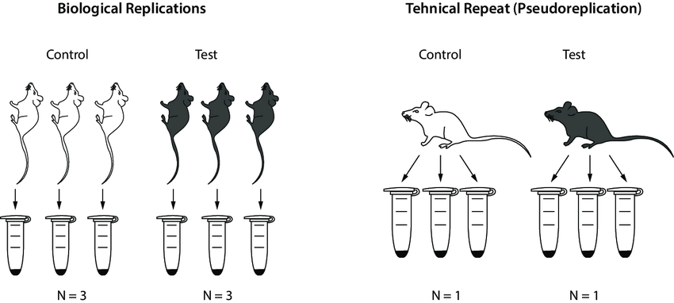
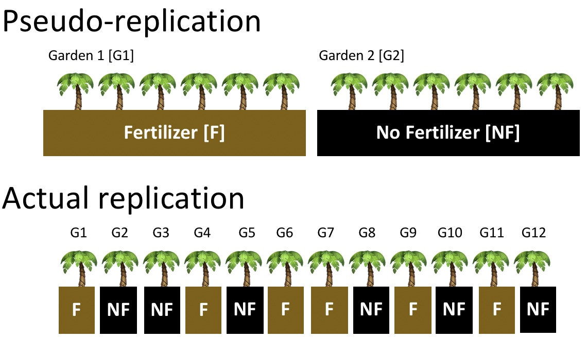
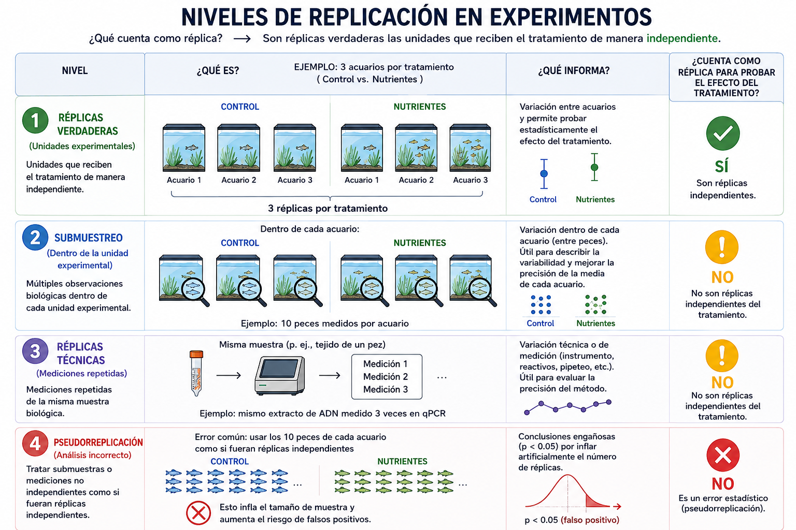

## Plan

* Discutir la integracion entre hipótesis y diseño experimental
* Definir diferentes niveles de replicación,  su uso y importancia 
* Introducir el concepto de pseudorreplicación y cómo evitarlo
* Explicar el diseño factorial, bloques y aleatorización


## Por qué importa el diseño experimental

- Ecología = sistemas complejos y variables  
- Mal diseño → conclusiones inválidas, esfuerzo desperdiciado  
- Buen diseño → inferencia más sólida, capacidad de generalizar  

## Ejemplo

::: {.fragment}

**Hipótesis**: La contaminación del aire reduce la diversidad de líquenes porque algunos contaminantes, como el SO₂, afectan su supervivencia y crecimiento.

:::


::: {.fragment}

Predicción: Los árboles en la ciudad tendrán menor diversidad de líquenes que los árboles en un parque nacional con menor contaminación atmosférica.

:::

## Datos colectados {.smaller}

| Sitio | Nivel de contaminación | Especies de Arbol | Diversidad |
|-------|-------------------|------------------------|---------|
| Alajuela | Alta | Guayacán | 3 |
| Alajuela | Alta | Higeron | 4 |
| Limon | Alta | Higeron | 2 |
| San José | Alta | Guayacán | 3 |
| San José | Alta | Higeron | 4 |
| Cartago | Alta | Higeron | 2 |
| Los Quetzales | Baja | Almendro | 8 |
| Tapanti | Baja | Guarumo | 7 |
| Manuel Antonio | Baja | Ceiba | 9 |
| Manuel Antonio | Baja | Almendro | 6 |
| Corcovado | Baja | Guarumo | 8 |

::: {.fragment}

**Resultado**: La diversidad de líquenes es mayor en los parques nacionales (promedio: 7.6) que en las ciudades (promedio: 3.3).

:::

::: {.fragment}

*Todo bien con este estudio? ¿Podemos concluir que la contaminación está asociada con menor diversidad de líquenes?*

:::

## Variables confusoras

Nuestro diseño experimental no controló otras variables que podrían explicar la diferencia en diversidad de líquenes:

  - la especie de árbol, 
  - la edad del árbol, 
  - la exposición a la luz,
  - la humedad, etc.

## Como modificar el diseño para controlar variables confusoras?

Debemos comparar árboles que sean similares en otras características que también podrían afectar la diversidad de líquenes.

Por ejemplo:

  * comparar árboles de la misma especie;
  * seleccionar árboles de edades o tamaños similares;
  * medir o controlar luz y humedad;
  * muestrear varios árboles independientes en cada condición.

## Unidad de observacion y unidad experimental

::: {.fragment}

Unidad observacional:

> un árbol de una especie y edad (tamaño) determinada.

:::

::: {.fragment}
Unidad experimental:

> Un sitio donde se mide la diversidad de líquenes en varios árboles independientes.

:::

## Que es la replica?

A) Arbol

B) Sitio


::: {.fragment}

> Como sabemos?

> A que nivel es el tratamiento? Al nivel de los sitios, o al nivel de los arboles?

:::


## Replicación y pseudoeplicación

---



---



---

## Definiciones

::: {.fragment}
- **Tratamiento**: Lo que se manipula  
- **Unidad Experimental**: La unidad más pequeña que puede recibir independientemente un tratamiento  
- **Replicación**: Múltiples unidades experimentales independientes por tratamiento  
:::

::: {.fragment}
::: {.callout-note title="¡Ojo!"}
Replicación = unidades experimentales, *no* muestras.
:::
:::

---

## ¿Qué cuenta como una réplica?

::: {.fragment}
Una réplica verdadera es una unidad que recibe el tratamiento de manera independiente de las otras unidades.
:::

::: {.fragment}
Por lo tanto, *no podemos identificar las réplicas solamente preguntando “¿qué medimos?”*.

Debemos preguntar:

> **¿Cuál es la unidad más pequeña a la que se asignó el tratamiento independientemente?**
:::

## ¿Qué cuenta como una réplica?

Ejemplo: 20 hojas de una planta

::: {.incremental}
  * Si toda la planta recibe el tratamiento -> las 20 hojas son submuestras de 1 unidad experimental.
  * Si cada hoja recibe independientemente un tratamiento -> las 20 hojas pueden ser 20 unidades experimentales.
:::

## Replicación y submuestreo {.smaller}

::: {.columns}

::: {.column}

::: {.fragment}

Supongamos:  

  * 3 aquarios control, 3 aquarios con nutrientes
  * medimos 10 peces por aquario

:::

::: {.fragment}

La jerarchia es:

> Tratamiento -> Aquario -> Peces -> Mediciones

:::
:::

::: {.column}

::: {.fragment}

Si el tratamiento estaba aplicado a los aquarios:

  * Unidad experimental: **Aquario**
  * Replica verdadera: **3 por tratamiento**
  * Peces: **submuestras biologicas (unidades de observacion, NO undidades experimental!)**
  * Mediciones repetidas por pez: **replica technica**

:::

:::

:::

## Replicación y submuestreo {.smaller}

Si el tratamiento estaba aplicado a los aquarios:

::: {.fragment}

  * Unidad experimental: **Aquario**
  * Replica verdadera: **3 por tratamiento**

  > Proporcionan replicacion para estimar el efecto del tratamiento

:::


::: {.fragment}

  * Peces por aquario: **submuestras biologicas (unidades de observacion, NO undidades experimental!)**

  > Permiten estimar la variacion dentro de una undidad experimental

:::


::: {.fragment}

  * Mediciones repetidas por pez: **replica technica**

  > Permiten estimar variacion (o error) asociada con medicion o de analisis 

:::

## Pseudoréplicacion

> Submuestras, replicas technicas, o otros tipos de observaciones no-independientes cuales las analizamos como si fueran replicas experimentales independientes.

  * Tiene el efecto de aumentar el sample size falsamente.
  * Tienden a mejorar el poder de analisis estadisticos, pero falsamente.
  * Introducen sesgo hacia menor variacion natural

---



---

## Vinculo entre Hypotesis y Deseño

## Diatomeas y Salinidad

```
Aislamiento de una cepa -->

   cultivo stock en su salinidad habitual --> 

   inoculación de diferentes salinidades --> 

   varios cultivos independientes por salinidad -->

   transferencias sucesivas --> 

   medición del crecimiento.
```

## Diatomeas y Salinidad

```
                          Cepa A
                      cultivo stock
                           │
          ┌────────────────┼────────────────┐
          ↓                ↓                ↓
        8 ppt            16 ppt            24 ppt
      ┌──┼──┐           ┌──┼──┐            ┌──┼──┐
      ●  ●  ●           ●  ●  ●            ●  ●  ●
     C1 C2 C3           C1 C2 C3           C1 C2 C3
```


## Cual es N (sample size, numbero de replicas)? {.smaller}


::: {.columns}

::: {.column}

Supongamos:

  * 5 especies
  * 3 cepas por especie
  * 5 salinidades
  * 3 cultivos por salinidad
  * 10 transferencias
  * 5 mediciones por cultivo por salinidad por transferencia

:::

::: {.column}

::: {.fragment}

Cuantas replicas tenemos?

:::

::: {.fragment}

> La pregunta no tiene respuesta sin conocer la hipotesis!

:::

:::

:::

## Hipótesis -> Nivel de replicación / Unidad de inferencia {.smaller}

H1: La tolerancia a la salinidad es diferente entre especies

::: {.fragment}

Unidad experimental: **especie**
Sample size: **5 especies** 
:::

::: {.fragment}

H2: La tolerancia a la salinidad es diferente entre cepas de la misma especie

:::

::: {.fragment}
Unidad experimental: **cepa**
Sample size: **3 cepas por especie**
:::


::: {.fragment}

H3: La tolerancia a la salinidad es diferente entre cultivos de la misma cepa

:::

::: {.fragment}
Unidad experimental: **cultivo**
Sample size: **3 cultivos por cepa**
:::


## Tipos de diseño experimental

::: {.columns}
::: {.column}
::: {.fragment}
- **Diseño experimental**  
  - El investigador manipula tratamientos (ej. sombreado vs no sombreado).
  - Inferencia más fuerte sobre causa-efecto. Requiere control de factores confusores.  
:::
:::
::: {.column}
::: {.fragment}
- **Diseño natural**  
  - El investigador aprovecha la variación natural (ej. arroyos soleados vs sombreados).  
  - No hay asignación verdadera de tratamientos   
:::

:::
:::

::: {.fragment}
::: {.callout-note title="¡Ojo!"}
Incluso sin manipulación, es necesaria una definición clara de *unidades experimentales* y *replicación*.
:::
:::

---

## Diseño Factorial

- **Definición:** Se prueban todas las combinaciones de factores.  
- Ejemplo: Dos factores → luz (alta/baja) × nutrientes (altos/bajos)  
  - Tratamientos = 2 × 2 = 4 combinaciones  
- Ventaja: puede detectar **efectos de interacción** (cómo se combinan los factores).  

---

```{r}
#| label: fig-factorial
#| fig-cap: "2×2 diseño factorial: Luz x Nutrientes."
#| fig-width: 12
#| fig-height: 6
#| echo: false
library(ggplot2)

# Data for a 2x2 factorial tile schematic
df_fact <- expand.grid(
  Light = c("Luz baja", "Luz alta"),
  Nutrients = c("Nutrientes bajos", "Nutrientes altos")
)
df_fact$Treatment <- paste(df_fact$Light, df_fact$Nutrients, sep = "\n")

# Plot
ggplot(df_fact, aes(x = Nutrients, y = Light, fill = Treatment)) +
  geom_tile(color = "white", linewidth = 0.6) +
  geom_text(aes(label = Treatment), fontface = "bold", size = 8) +
  scale_y_discrete(limits = rev(levels(df_fact$Light))) +
  labs(x = NULL, y = NULL) +
  theme_minimal(base_size = 15) +
  theme(
    panel.grid = element_blank(),
    axis.text.x = element_text(margin = margin(t = 6)),
    axis.text.y = element_text(margin = margin(r = 6))
  )
```

---

## Bloques

- **Definición:** Agrupar unidades experimentales en bloques que comparten condiciones similares.  
- Ejemplo: La fertilidad del suelo varía a través de un campo → cada bloque contiene todos los tratamientos.  
- Propósito: controlar fuentes conocidas de variación.  
- Análisis: el bloque se incluye como factor en el modelo (aleatorio o fijo).  

> Los bloques reducen el *ruido* de la heterogeneidad.  

---

```{r}
#| label: fig-blocking
#| fig-cap: "Diseño de bloques completos aleatorizado: cada bloque contiene todos los tratamientos."
#| fig-width: 10
#| fig-height: 6
#| echo: false
library(dplyr)
library(tidyr)
set.seed(42)

treatments <- c("Control", "Luz", "Nutrientes", "Luz+Nutrientes")
blocks <- paste("Block", 1:3)

# Create a layout with randomized treatment order within each block
df_block <- expand.grid(Block = blocks, Plot = 1:length(treatments)) %>%
  group_by(Block) %>%
  mutate(Treatment = sample(treatments, size = n(), replace = FALSE)) %>%
  # mutate(Treatment = treatments) %>%
  ungroup() %>%
  mutate(Block = factor(Block, levels = blocks), PlotPos = Plot)

# Plot as rows = blocks, columns = plots
ggplot(
  df_block,
  aes(x = PlotPos, y = Block, fill = Treatment, label = Treatment)
) +
  geom_tile(color = "white", linewidth = 0.6, height = 0.8) +
  geom_text(size = 6, fontface = "bold", color = "black") +
  scale_x_continuous(breaks = 1:4, labels = paste("Plot", 1:4)) +
  scale_fill_brewer(palette = "Set2") +
  labs(x = NULL, y = NULL) +
  theme_minimal(base_size = 25) +
  theme(
    panel.grid = element_blank(),
    legend.position = "bottom",
    axis.text.x = element_text(margin = margin(t = 6)),
    axis.text.y = element_text(margin = margin(r = 6))
  )
```

---

## Aleatorización

- **Definición:** Asignación aleatoria de tratamientos a unidades experimentales.  
- Propósito: evita sesgo sistemático.  
- Puede ser completa o restringida (dentro de bloques).  

**Ejemplo:** Asignar aleatoriamente sombreado vs control a estanques, no solo "primera mitad sombreada, segunda mitad control."

---

```{r}
#| label: fig-randomization
#| fig-cap: "Asignación aleatoria de tratamientos en una cuadrícula de campo (dentro de bloques)."
#| fig-width: 10
#| fig-height: 10
#| echo: false
library(dplyr)
library(ggplot2)
set.seed(123)

# Grid layout (e.g., 4 columns × 6 rows), with 3 horizontal blocks
n_cols <- 4
n_rows <- 6
treats <- c("Control", "Luz", "Nutrientes", "Luz+Nutrientes")

grid <- expand.grid(col = 1:n_cols, row = 1:n_rows) %>%
  mutate(
    Block = cut(
      row,
      breaks = c(0, 2, 4, 6),
      labels = c("Block 1", "Block 2", "Block 3")
    )
  )

# Randomize treatments within each block with near-equal counts
assign_block <- function(n, levels) {
  rep_len(sample(levels), n) |> sample(n) # shuffle
}

df_rand <- grid %>%
  group_by(Block) %>%
  mutate(Treatment = assign_block(n(), treats)) %>%
  ungroup()

# Plot grid with block facets (or block borders)
ggplot(
  df_rand,
  aes(x = col, y = row, fill = Treatment, label = substr(Treatment, 1, 1))
) +
  geom_tile(color = "white", linewidth = 0.5) +
  geom_text(size = 8, fontface = "bold", color = "black") +
  scale_y_reverse(breaks = 1:n_rows) +
  scale_x_continuous(breaks = 1:n_cols) +
  scale_fill_brewer(palette = "Set2") +
  labs(x = "Column", y = "Row") +
  theme_minimal(base_size = 25) +
  theme(panel.grid = element_blank(), legend.position = "bottom") +
  facet_wrap(~Block, ncol = 1, scales = "free_y")
```

## Controles

- **Condición de referencia:** una condición comparativa  que sirve como punto de comparación para los demás tratamientos.
- **Debe incluirse en los bloques:** cada bloque debería contener la condición de referencia para permitir comparaciones dentro del bloque y controlar la variación entre bloques.
- **Propósito**: estimar efectos relativos de los tratamientos y evitar confundir efectos de bloque con efectos de tratamiento.

---

## Resumen

- **Diseño factorial**: probar múltiples factores y sus interacciones.  
- **Bloques**: controlar variación agrupando unidades similares.  
- **Aleatorización**: protegerse contra sesgo.  
- **Controles**: condición de referencia para comparaciones.

---

## Bibliografia

Statistics done wrong: https://www.statisticsdonewrong.com/pseudoreplication.html

Marshall, D.J., 2024. Principles of experimental design for ecology and evolution. Ecology Letters, 27(4), p.e14400.
